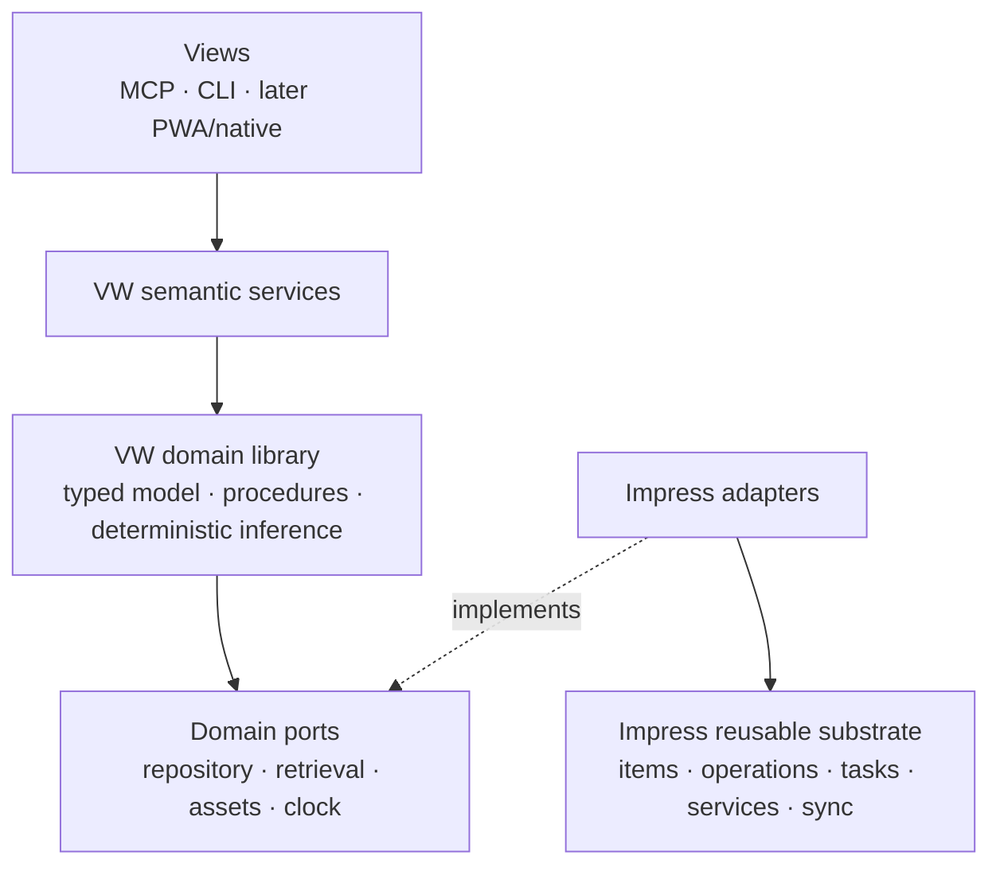
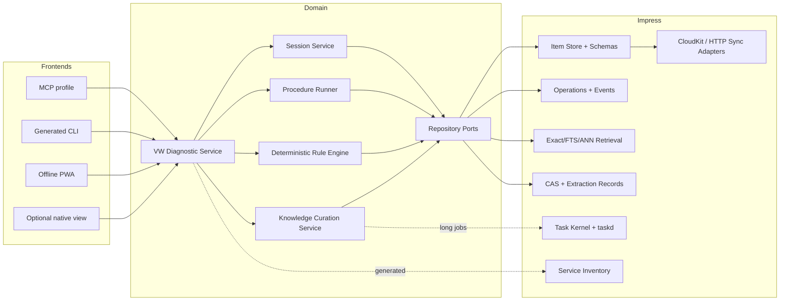
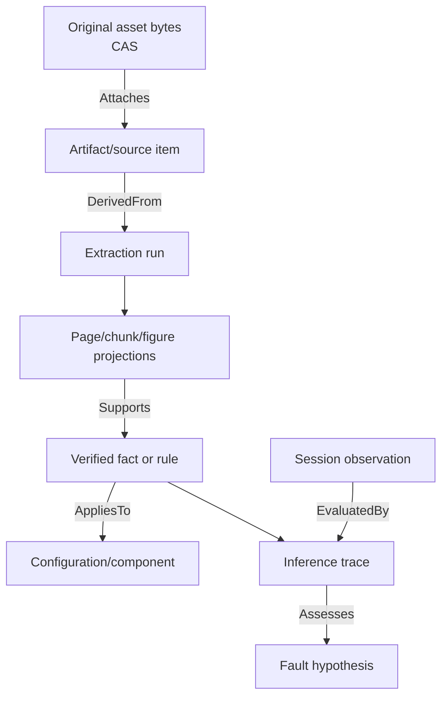
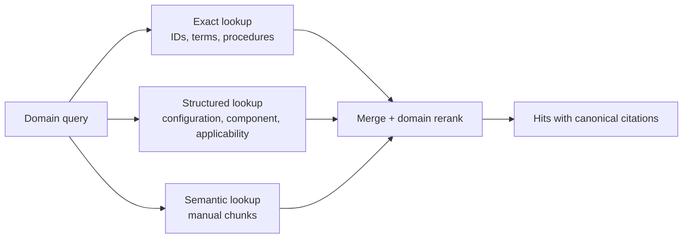

# Expert-System Architecture Inside Impress

**Status:** proposed architecture for validation  
**First validation domain:** 1978 California VW Type 2, L-Jetronic  
**Primary constraint:** reuse Impress infrastructure without making the VW
domain shape the platform

## Decision in one paragraph

Build the VW assistant as a typed Rust domain library and semantic service
surface above Impress, not as a new database-backed chat application. Reuse the
unified item store, typed relations, operation journal, task kernel, generated
service inventory, MCP server, sync engine, and native chassis. Generalize only
the already-duplicated asset/extraction/citation/retrieval seams. Keep
observation, measurement, procedure, hypothesis, and inference semantics in
the domain layer until a second expert domain proves an identical abstraction.

The authoritative dependency direction is:



No view, LLM, or MCP handler may bypass the domain service to mutate SQLite.

## 1. Requirements and boundaries

### Functional requirements

- ingest heterogeneous manuals, images, tables, service notes, and user files;
- extract text page by page and OCR pages/images when embedded text is absent;
- preserve the original asset and every derivation with reproducible locators;
- curate structured, versioned, source-supported facts and diagnostic rules;
- record observations, measurements, procedures, hypotheses, and repairs;
- resume a diagnostic case across processes/devices;
- provide deterministic evidence-based recommendations and explanations;
- expose semantic operations through MCP first;
- support an offline-first iPhone PWA later;
- permit new expert domains without changing the store or MCP protocol.

### Non-functional requirements

- **Auditability:** every conclusion identifies the rules, evidence, and source
  citations used.
- **Determinism:** identical knowledge-pack version and session state yield the
  same v1 ranking and next-test recommendation.
- **Local-first:** core diagnosis and the working session do not require cloud
  or an LLM.
- **Safety:** procedures carry explicit hazards, preconditions, stop conditions,
  and confirmation points.
- **Idempotency:** re-ingesting unchanged bytes or replaying an MCP command does
  not duplicate knowledge or session events.
- **Replaceability:** OCR, embeddings, LLMs, and probabilistic models are ports,
  not persistence contracts.

### Explicit non-goals for v1

- autonomous repair instructions without user confirmation;
- probabilistic failure claims without calibrated data;
- automatic promotion of OCR/LLM output into executable knowledge;
- a dynamic third-party binary plugin system;
- a new graph database, server database, or domain-specific session database;
- a polished VW GUI before the MCP and domain contracts are proven.

## 2. The minimal primitives hypothesis

The proposed eight concepts are directionally correct, but they mix platform
mechanisms with expert-domain semantics. The most stable foundation is two
layers of primitives.

### Platform primitives already earned by Impress

| Primitive | Existing Impress form | Role |
|---|---|---|
| Record | `Item` plus versioned Rust schema | Stable identity, typed payload, universal metadata |
| Relation | `TypedReference` plus parent | Graph topology and causal/domain links |
| Operation | attributed operation item and materialized state | Audit history, undo, synchronization input |
| Asset | artifact/blob metadata plus content-addressed bytes | Immutable source or generated bytes |
| Task | `task@1.0.0`, DAG edges, executors | Durable background work and review checkpoints |
| Service | `#[impress_service]` inventory | One business operation projected to MCP/CLI/agents |
| Agent run | `agent-run@1.0.0` and tool/run provenance | Records how non-deterministic work was produced |
| View | native descriptor/registry or transport projection | Presents domain state without owning it |

### Expert-profile primitives to prove with domains

| Primitive | Definition | Initial ownership |
|---|---|---|
| Knowledge | A verified typed assertion or rule with applicability and citations | VW domain; shared epistemic envelope later |
| Observation | A reported or detected state of the subject, with acquisition and confidence | VW domain |
| Measurement | A typed quantity plus unit, conditions, uncertainty, and instrument context | VW domain |
| Procedure | Versioned human workflow with hazards, steps, branches, and result schema | VW domain; candidate for extraction after a second use |
| Evidence | Evaluation of an observation/source against a hypothesis under a rule | VW domain |
| Inference | Pure evaluation from state + versioned rule set to trace + ranking | VW domain behind a replaceable engine port |
| Session/case | Aggregate root pinning subject, knowledge version, observations, runs, and decisions | VW domain |

This yields a better formulation of the original hypothesis:

> Expert systems are built from platform records, relations, operations,
> assets, tasks, services, agents, and views; a reusable expert profile may add
> knowledge, observations, procedures, evidence, inference, and cases once
> their semantics have been validated in more than one domain.

## 3. Proposed component architecture



### Recommended crate boundaries

Names are proposals, not implementation commitments.

| Crate/module | Owns | Must not own |
|---|---|---|
| `vw-domain` | Typed VW entities, applicability, quantities, procedure definitions/runs, rule AST, inference trace, session invariants | SQLite, MCP JSON-RPC, OCR SDKs, SwiftUI |
| `vw-service` | Semantic async traits and DTOs decorated with `#[impress_service]` | Business rules or SQL |
| `vw-impress-adapter` | Schema registration, typed item mapping, store queries, operations, task executors, retrieval adapters | UI or LLM prompts |
| Existing `impress-core` | Items, references, operations, queries, store, task state | VW nouns and diagnostic semantics |
| Proposed shared retrieval/asset modules | CAS descriptors, source locators, extraction runs, generic chunks and embedding index ports | Publication or VW-specific metadata |
| `impress-mcp` | Protocol host and inventory projection | Domain decision logic |

Do **not** create `impress-expert` on day one. Keep the domain-facing ports and
types clean enough to extract later, then use a second domain as the proof.

## 4. Generic versus domain-specific responsibilities

| Concern | Generic Impress responsibility | VW responsibility |
|---|---|---|
| Identity | Item IDs, content hashes, schema refs | VIN/vehicle identifiers, component and rule keys |
| Persistence | Transactions, envelope, payload, tags, edges | Aggregate mapping and invariants |
| Provenance | Actor, operations, task/agent runs, derivation edges | Evidence meaning and diagnostic rationale |
| Assets | Immutable bytes, MIME, availability, extraction lineage | “manual,” “wiring diagram,” “service bulletin” classification |
| Retrieval | Exact/FTS/vector mechanisms and chunk locators | Applicability filters, vocabulary, result ranking policy |
| Workflow | Background tasks, retry, review suspension | Diagnostic procedure semantics and safety gates |
| Inference | No default expert inference | Rule language, effects, ranking, trace |
| Session | Durable records and operations | Diagnostic lifecycle and allowed commands |
| API | Generated service and MCP/CLI projection | Semantic diagnostic operations and DTOs |
| UI | Shared native chrome and transport adapters | Domain screens, wording, diagrams, forms |
| Sync | Item/edge/tombstone transport and conflicts | Which knowledge pack/session subset is offline-capable |

## 5. Ports and dependency inversion

The domain library should compile and test without Impress. Suggested ports:

```rust
trait DiagnosticRepository {
    fn load_session(&self, id: SessionId) -> Result<DiagnosticSession>;
    fn commit(&self, command: SessionCommand) -> Result<SessionRevision>;
    fn applicable_rules(&self, ctx: &ApplicabilityContext) -> Result<Vec<DiagnosticRule>>;
    fn applicable_procedures(&self, ctx: &ApplicabilityContext) -> Result<Vec<Procedure>>;
}

trait KnowledgeRetrieval {
    fn exact(&self, query: ExactKnowledgeQuery) -> Result<Vec<KnowledgeHit>>;
    fn semantic(&self, query: SemanticKnowledgeQuery) -> Result<Vec<KnowledgeHit>>;
    fn resolve_citation(&self, id: CitationId) -> Result<ResolvedCitation>;
}

trait DiagnosticEngine {
    fn evaluate(
        &self,
        snapshot: &DiagnosticSnapshot,
        rules: &RuleSet,
    ) -> Result<InferenceTrace>;
}
```

These are illustrative contracts, not implementation. The Impress adapter
maps repository commands to operation-backed item updates. Tests use in-memory
implementations and golden rule fixtures.

## 6. State and consistency model

### Aggregate authority

`DiagnosticSession` is the aggregate root. A command is accepted only against
an expected session revision. On success the adapter commits, atomically:

1. new/changed domain items;
2. attributed operation items;
3. required relations;
4. the new session revision marker.

MCP and PWA requests carry `command_id` for deduplication and
`expected_revision` for conflict detection. A stale client receives a typed
conflict with the current revision and a compact change summary; it never gets
silent last-write-wins at the domain-command level.

### Long-running work

Use Impress tasks for operations that can outlive a request:

- asset import and hashing;
- PDF extraction and OCR;
- figure/table extraction;
- embedding/re-indexing;
- LLM-assisted knowledge proposals;
- knowledge-pack validation.

Interactive actions such as recording a measurement, advancing a procedure,
or evaluating hypotheses remain synchronous domain commands. They should not
be modeled as agent jobs.

### Version pinning

Every session pins:

- domain-pack ID and semantic version/content hash;
- rule-set version;
- procedure versions as each run begins;
- source asset/extraction versions behind citations;
- inference-engine identifier/version.

Updating the knowledge pack creates an explicit “re-evaluate under new pack”
command. It never silently rewrites prior conclusions.

## 7. Knowledge representation decision

Use a **hybrid representation over the existing Impress store**:

- relational SQLite columns/tables for identity, state, indexes, transactions,
  tags, and frequently filtered payload fields;
- typed JSON payloads for additive domain records;
- typed edges for topology, causality, evidence, applicability, and provenance;
- FTS/vector indexes as rebuildable projections;
- content-addressed files for original and derived bytes.



Why not the alternatives alone:

- **pure relational:** strong constraints, but schema churn and domain-pack
  extension become costly; it also duplicates the existing item graph;
- **pure document:** easy ingest but weak relations, constraints, and hot
  structured queries;
- **pure graph:** introduces a second authority and makes transactions, local
  sync, FTS, and migrations harder;
- **hybrid:** matches the store Impress already operates and preserves typed
  Rust aggregates above flexible persistence.

## 8. Deterministic diagnostic engine

Version 1 should use an auditable rule system with ordinal weighted evidence,
hard exclusions, and explicit next-test suggestions.

| Candidate | Strength | Problem for v1 | Verdict |
|---|---|---|---|
| Decision trees | Easy to follow | Duplicate branches, poor handling of partial/conflicting evidence, brittle growth | Importable form, not primary model |
| Bayesian networks | Principled uncertainty | Requires defensible priors and conditional probabilities; authoring/calibration burden | Later backend |
| Factor graphs | Flexible model composition | Complexity far beyond available data and authoring needs | Not v1 |
| Production rules | Deterministic, explainable, modular, source-citable | Conflict resolution and ranking must be designed explicitly | Core v1 representation |
| Weighted evidence | Handles incomplete/conflicting inputs and ranks next tests | Scores can be mistaken for probabilities | Combine with rules; label scores ordinal |

### V1 evaluation contract

1. Filter rules and hypotheses by vehicle/configuration applicability.
2. Evaluate hard preconditions. A failed hard condition marks a rule
   inapplicable; a hard contradiction can exclude a hypothesis.
3. Convert matched rule effects into evidence contributions with named ordinal
   strengths (`weak`, `moderate`, `strong`), polarity, rationale, and citation.
4. Aggregate support minus contradiction using fixed integer weights. This is a
   **priority score**, never a probability.
5. Produce a complete trace including rules considered, facts missing, rules
   fired, exclusions, contradictions, and stable tie-breaking.
6. Rank candidate next procedures by expected discriminatory value, safety,
   prerequisites, cost class, and user progress—not by LLM preference.

The inference engine is pure. Persist the resulting trace and selected actions,
not hidden mutable engine state.

## 9. Retrieval architecture

Retrieval is a composition of three modes:



- exact lookup leads for part numbers, procedure keys, fault codes, connector
  names, and quoted terms;
- structured retrieval is authoritative for configuration applicability,
  procedure prerequisites, accepted facts, and rule selection;
- semantic retrieval discovers explanatory passages but cannot by itself
  create a fact, rule, or diagnosis;
- every hit contains a `SourceCitation`; page images, figures, and tables are
  retrieved through their locator rather than embedded ad hoc in text;
- result fusion is deterministic and records which retriever contributed each
  hit.

## 10. MCP-first and LLM boundary

The domain flow is:

```text
Rust domain model
    ↓
Domain services and repositories
    ↓
Generated service inventory
    ↓
VW-only MCP projection
    ↓
LLM or other client
```

The LLM may:

- help map free text to candidate observations;
- ask the user to confirm structured values;
- call semantic diagnostic operations;
- explain a returned inference trace in accessible language;
- propose knowledge during curation, clearly marked unverified.

The LLM may not:

- execute SQL or arbitrary item mutations;
- invent measurement units/values or silently normalize them;
- mark knowledge verified;
- change rule weights or applicability during a session;
- return its own diagnosis in place of `evaluate_session`;
- omit citations or safety gates supplied by the service.

See [MCPArchitecture.md](MCPArchitecture.md) for the concrete surface.

## 11. Offline-first PWA architecture

The current Rust-served web UI is responsive but not offline-first: it uses
`localStorage`, sends live HTTP requests, serves `no-store`, and has no service
worker. The VW PWA should be a separate view adapter over the domain service.

### Client storage

- service worker cache: versioned application shell and static assets;
- IndexedDB: typed projections for vehicles, session snapshots, procedure runs,
  citations, pending commands, sync cursor, and an installed knowledge pack;
- Cache Storage: explicitly selected source page images/figures and immutable
  asset responses keyed by content hash;
- no credentials in IndexedDB payload records; use secure, revocable pairing
  and platform-appropriate token storage.

### Offline knowledge split

| Client-local | Server-authoritative |
|---|---|
| Active vehicle/session projection | Full item/operation graph |
| Verified rule/procedure pack for selected configuration | All domains and historical packs |
| Required citations and selected page/figure assets | Full original document corpus and embeddings |
| Exact local indexes over installed pack | Global FTS/vector indexes |
| Pending semantic commands with IDs/revisions | Command validation and canonical commit |

### Synchronization

1. Pull an immutable, signed/hashed knowledge-pack manifest and missing content
   by hash.
2. Pull session changes after a monotonic cursor as typed domain events or
   projections—not raw SQLite rows.
3. Queue offline commands with `command_id`, `expected_revision`, and local
   timestamp.
4. Push commands in order. The server returns committed revision, deduplicated
   status, or a typed conflict.
5. Rebase only commutative commands automatically (for example adding a new
   observation with a unique ID). Require review for procedure-position or
   hypothesis-disposition conflicts.
6. Recompute local deterministic inference with the pinned rule pack; compare
   its trace hash with the server on sync to detect implementation drift.

CloudKit remains the native-app sync path. The PWA uses an authenticated HTTP
adapter over the same domain service/store; it does not open or mirror the
SQLite database format.

## 12. Reliability, security, and observability

- Validate every external DTO at the service boundary and every persisted item
  against its schema/domain invariants.
- Treat OCR, manual text, web pages, and tool results as untrusted content, not
  instructions.
- Use content hashes and bounded decompression/upload sizes for assets.
- Store secrets in keychain/environment; never in item payloads or synced
  knowledge packs.
- Log mutation, commit, and projection points using Impress logging; include
  correlation/session/command IDs but avoid sensitive free text where possible.
- Export a complete portable case bundle: domain records, rule/procedure
  versions, citations, trace, and referenced source hashes.
- Fail closed when a required citation, rule version, unit conversion, or asset
  is unavailable. “Unknown” is a valid diagnostic result.

## 13. Decisions to revisit only with evidence

| Decision | Revisit when |
|---|---|
| Keep expert types in VW crate | A second domain has a field-for-field compatible implementation |
| Rules + ordinal evidence | Calibrated datasets support validated probabilistic parameters |
| SQLite/item hybrid | Measured workload cannot meet latency/scale targets with indexes/projections |
| Compile-time domain registration | Independent domain-pack distribution is required |
| HTTP PWA sync adapter | Native-only mobile proves sufficient or another web client establishes a shared protocol need |
| Apple OCR first | Headless/Linux ingestion becomes a supported deployment |

## Related documents

- [ImpressReuseAudit.md](ImpressReuseAudit.md)
- [VWKnowledgeArchitecture.md](VWKnowledgeArchitecture.md)
- [MCPArchitecture.md](MCPArchitecture.md)
- [FutureRoadmap.md](FutureRoadmap.md)
