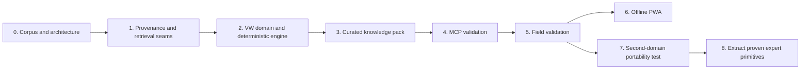

# Expert-System Roadmap and Generalization Plan

**Status:** proposed sequence with evidence gates; dates intentionally omitted

> **Implementation checkpoint (2026-08-05):** the reusable source primitives,
> generic source service, standalone VW domain/engine, Impress adapter,
> semantic generated service, focused MCP host, and vw-mcp binary now exist. A
> three-source, 531-page local corpus is hash-verified, OCRed on-device with
> Apple Vision, indexed, and exposed through bounded semantic MCP retrieval
> with page citations and 39,162 positioned line observations. A reusable
> `ImpressOCR` library/CLI now owns the native image and scanned-PDF path; the
> existing Impress AI web stack also exposes a connected `/vw` phone profile
> backed by local oMLX and a read-only semantic VW tool projection. The
> checked-in bootstrap pack remains intentionally empty: source review,
> applicability curation, expert field validation, redistribution decisions,
> and the offline PWA remain gated work; see
> [VWImplementation.md](VWImplementation.md).

## 1. Outcome and sequencing principle

The shortest credible path is to validate a thin vertical slice for one exact
VW configuration while improving only the Impress seams that the slice proves
are missing. The roadmap is ordered by architectural risk, not UI visibility.

No phase requires a probabilistic engine, graph database, dynamic plugin ABI,
or mobile UI framework.

## 2. Phase 0 — architecture and corpus inventory

### Work

- Accept or revise the boundaries in this document set.
- Inventory authoritative VW sources by title, edition, revision, format,
  licensing constraints, scan quality, and applicability.
- Define the exact supported vehicle identity and explicit exclusions.
- Select 10–20 representative diagnostic cases spanning incomplete,
  contradictory, and configuration-dependent evidence.
- Record an ADR for the domain-service boundary and hybrid representation.

### Exit evidence

- Every source has an owner and ingestion disposition.
- The supported configuration can be distinguished from close variants.
- Representative cases have expected outcomes and source references.
- No domain implementation has to infer licensing or configuration policy.

### Stop condition

If authoritative source material cannot be stored, extracted, and cited under
its license, stop before building a diagnosis product. Retrieval quality cannot
repair an absent source-of-truth agreement.

## 3. Phase 1 — close only proven Impress substrate gaps

### Work

1. Introduce a generic structured source locator/citation model that can address
   page labels, physical pages, text spans, figures, tables, and regions.
2. Define a stable content-chunk identity independent of publication-specific
   types.
3. Record extraction runs, engine versions, content hashes, warnings, and parent
   asset references.
4. Consolidate the asset/blob port and choose one ownership path for immutable
   source bytes and derivatives.
5. Put exact, structured, and semantic retrieval behind a domain-neutral port;
   reuse the current embedding/index implementation through an adapter.
6. Add migration, round-trip, and citation-resolution tests before moving VW
   content onto the new seams.

### Exit evidence

- A PDF page, figure region, OCR span, and Markdown section all resolve through
  the same locator contract.
- Re-importing identical bytes produces stable asset and chunk identities.
- An extraction is reproducible or reports exactly why it is not.
- Existing Imbib semantic search continues to work through its compatibility
  adapter.

### Scope guard

Do not add Observation, Hypothesis, or Procedure to `impress-core` in this
phase. The VW domain has not yet demonstrated that their representation is
shared by another domain.

## 4. Phase 2 — VW domain and deterministic engine

### Work

- Create the typed VW domain library and repository ports.
- Register VW schemas and references through a thin Impress adapter.
- Implement configuration applicability as an explicit expression language.
- Implement immutable observations, typed measurements, procedures, session
  commands, and optimistic revisions.
- Implement the pure rule evaluator, ordinal evidence ranking, trace generation,
  and safe next-test selection.
- Build an in-memory repository first for fast domain tests, then run the same
  contract suite against the Impress adapter.
- Seed a very small hand-curated knowledge set for the representative cases.

### Exit evidence

- Domain tests run without SQLite, MCP, UI, or an LLM.
- In-memory and Impress repository adapters pass the same behavioral contract.
- Every assessment is replayable from a pinned knowledge pack and session
  revision.
- Contradictory and unknown evidence produces explicit results, never a crash or
  an invented default.
- Unsafe procedures fail before any state transition.

### Stop condition

If the domain model needs pervasive knowledge of `Item`, JSON payload layouts,
or MCP request shapes, repair the port boundary before adding more features.

## 5. Phase 3 — ingestion and curated knowledge pack

### Work

- Build watched-folder ingestion from existing Impress services.
- Connect the implemented native PDF OCR, layout-region capture, chunking, and
  indexing path to durable task-backed stages; add text-first fallback and
  semantic figure/table extraction.
- Create the curation lifecycle: `extracted -> proposed -> verified -> published`,
  with rejection and supersession.
- Provide a reviewer view or minimal administrative CLI for source comparison,
  applicability, units, and citation resolution.
- Compile a signed or content-addressed knowledge-pack manifest.

### Exit evidence

- Every published fact, rule, procedure step, threshold, and hazard resolves to
  at least one reviewable citation.
- Unreviewed extraction cannot become executable diagnostic knowledge.
- OCR confidence and extraction warnings are visible to reviewers.
- Rebuilding the same pack from unchanged inputs yields the same logical IDs
  and a stable manifest hash.
- Replacing a source creates a new pack rather than rewriting a session's past.

### Scope guard

Automatic fact extraction may propose curation records. It must not publish
rules or safety procedures without review.

## 6. Phase 4 — MCP-first validation

### Work

- Expose the VW domain service using Impress service macros and generated
  descriptors.
- Create the restricted `vw-diagnostic` surface profile.
- Add orientation resources and semantic diagnostic tools.
- Add command idempotency, revision conflicts, typed error mapping, and task
  status for long-running ingestion.
- Run contract, profile, CLI/MCP parity, and golden trace tests.
- Evaluate with multiple LLM clients while keeping the engine output fixed.

### Exit evidence

- A fresh client can discover the workflow without raw database access.
- The same transcript yields the same domain commands and deterministic trace,
  apart from explicitly recorded user differences.
- Every evidence-bearing answer includes source and pack identity.
- The LLM cannot bypass configuration, revision, or procedure safety checks.
- Domain functions remain usable without MCP.

## 7. Phase 5 — field validation and operational hardening

### Work

- Run the representative cases with knowledgeable human reviewers.
- Record false leads, missing configuration distinctions, unusable procedures,
  citation failures, and retrieval misses.
- Test restart recovery, interrupted procedures, backup/restore, pack upgrades,
  and concurrent client edits.
- Define log redaction, retention, export, and deletion policy for sessions.
- Instrument retrieval paths, rule coverage, unknown rates, and safety stops.

### Exit evidence

- Domain experts approve the supported scope and cited procedure wording.
- Every incorrect recommendation has a traceable cause category.
- Restart and retry do not duplicate commands or lose procedure state.
- A session remains explainable after its knowledge pack is superseded.
- Operational metrics expose absence of evidence rather than merely tool uptime.

### Release boundary

Until this gate passes, label the system as a research diagnostic assistant,
not an authoritative repair manual or autonomous mechanic.

## 8. Phase 6 — offline-first PWA

### Work

- Add an HTTP adapter over the same domain service; do not fork business logic.
- Implement a service worker, app-shell cache, IndexedDB domain projections,
  immutable knowledge-pack cache, and an outbox of idempotent commands.
- Synchronize commands with `command_id` and `expected_revision`, returning
  structured conflicts for reconciliation.
- Download configuration-scoped local knowledge and retain cited source slices
  needed by offline procedures.
- Add cache quotas, pack verification, explicit eviction, and privacy controls.
- Meet iPhone installability, touch, viewport, background interruption, and
  accessibility requirements.

### Exit evidence

- A session can be created, observed, evaluated, and resumed in airplane mode
  using a previously installed knowledge pack.
- Reconnect sends commands exactly once and does not silently resolve conflicts.
- Cached citations still resolve to the pinned pack.
- Eviction never deletes unsynchronized session commands.
- The installed application survives process termination and normal iOS storage
  pressure within documented limits.

The current static HTTP shell is useful as a transport experiment but is not
this milestone: `no-store` caching and `localStorage` do not provide an
offline-first durable model.

## 9. Phase 7 — second-domain portability test

Select a second domain with materially different data but similar workflow.
Laboratory instrument troubleshooting or a scientific-software assistant is a
better test than another vehicle because it reveals accidental VW assumptions.

### Portability test

Build the second domain using:

- the same asset, citation, extraction, chunk, retrieval, session-storage,
  task, service, and view adapters;
- a new domain vocabulary, applicability system, procedure library, and rule
  set;
- no changes to the VW crate.

Track each duplicated abstraction. Extract it to an expert-profile crate only
when both domains require equivalent invariants and lifecycle, not merely the
same noun.

### Exit evidence

- The second domain ships without schema exceptions in `impress-core`.
- Shared code has two real callers and domain-neutral terminology.
- Domain-specific safety and regulation remain outside the shared layer.
- A third prospective domain can map onto the primitives without changing the
  storage or service substrate.

## 10. Phase 8 — extract proven expert primitives

Only after the portability test, consider an `impress-expert` profile containing
the smallest proven set, likely:

- sourced knowledge assertions and citation resolution;
- observation and measurement envelopes;
- procedure definition/run lifecycle;
- evidence assessments and deterministic inference traces;
- persistent case/session command conventions;
- semantic MCP response conventions.

Extraction should preserve domain extension points and must not centralize
domain vocabularies, rule predicates, risk policy, or units that are not truly
universal.

## 11. Future reasoning upgrades

The deterministic rule engine remains the baseline and audit oracle. More
complex reasoning is justified only by evidence:

| Upgrade | Trigger | Required evidence |
|---|---|---|
| Calibrated weighted evidence | Rules rank poorly despite correct facts | Reviewed cases with reproducible ordinal outcomes |
| Bayesian network | Conditional probabilities materially change decisions | A defensible, maintained probability dataset |
| Factor graph | Repeated latent-variable or temporal coupling cannot be expressed cleanly | Benchmarks showing rule complexity and accuracy limits |
| Learned ranking | Large labeled case set and stable evaluation protocol exist | Held-out improvement, calibration, drift monitoring, fallback |

Probabilistic output must never be synthesized from arbitrary rule weights.
Any later model records its version, inputs, calibration set, and explanation
alongside the deterministic trace.

## 12. Exact future-domain mapping

The common foundation is architectural, not a universal ontology.

| Domain | Assets and knowledge | Observations | Procedures | Inference | Session/case | Domain layer that stays separate |
|---|---|---|---|---|---|---|
| Medical diagnosis | Guidelines, studies, images, formularies | Symptoms, examination, labs | Assessment and care pathways | Rules or validated clinical models | Patient encounter | Clinical terminology, consent, regulation, clinician authority |
| Laboratory instruments | Manuals, service bulletins, run logs, chromatograms | Alarms, calibration states, measured signals | Calibration, maintenance, troubleshooting | Fault isolation rules | Instrument incident | Vendor protocols, lab quality system, equipment safety |
| Scientific software | Documentation, source, issues, datasets | Errors, versions, environment facts | Reproduction, analysis, migration workflows | Compatibility and failure rules | Investigation | Language/runtime semantics and project policy |
| Cluster administration | Runbooks, configs, topology, telemetry | Alerts, resource and service states | Triage, mitigation, rollback | Dependency and policy rules | Incident | Credentials, blast-radius controls, site policy |
| Astronomical pipelines | Papers, instrument docs, FITS products, provenance | Quality flags, calibration residuals | Reduction and validation pipelines | Data-quality and lineage rules | Analysis run | Instrument models, coordinate systems, scientific validity |
| Research assistants | Papers, notes, datasets, code | Questions, claims, experiment results | Literature review and reproducible analysis | Evidence synthesis | Research project | Disciplinary methods, authorship, publication policy |

All six can reuse immutable assets, precise citations, extraction provenance,
versioned knowledge, typed observations, durable procedures, inference traces,
sessions, generated services, and multiple views. They cannot safely share one
domain schema or one risk model.

## 13. Measures of success

### Platform measures

- percentage of published knowledge with resolvable citations;
- stable-ID rate across unchanged re-ingestion;
- extraction and index reproducibility;
- command retry/idempotency failures;
- session replay success across releases;
- number of domain-specific branches added to shared crates (target: zero).

### Diagnostic measures

- representative-case rule coverage;
- rate of explicit `unknown` versus unsupported conclusions;
- correct configuration applicability;
- next-test usefulness and safety-stop accuracy;
- reviewer disagreement and correction turnaround;
- retrieval recall for the cited answer set.

### Generalization measures

- shared primitives with at least two production-quality callers;
- domain-specific code required per new application;
- time to add a new semantic MCP profile;
- migrations caused by domain assumptions in platform schemas;
- ability to replace an adapter without changing domain tests.

## 14. Risk register

| Risk | Early signal | Mitigation |
|---|---|---|
| Framework bloat | New core nouns appear before two domain implementations | Keep expert types in domain crates; require extraction evidence |
| False authority | LLM prose lacks visible source or uncertainty | Structured citations, verified status, safety wording, trace contract |
| Configuration leakage | Rules contain ad hoc model-year conditionals | Central applicability expressions and fixture coverage |
| OCR corruption | Thresholds or units differ from page images | Confidence flags, region view, reviewer approval, typed units |
| Retrieval fragmentation | Multiple IDs and indexes disagree | Stable chunk contract and one retrieval port |
| Non-reproducible sessions | Pack changes rewrite current answers | Pin packs, immutable rules, session revisions and trace hashes |
| Raw MCP escape hatch | Agent mutates item JSON directly | Restricted semantic profile and surface tests |
| Offline data loss | Browser cache is mistaken for durable state | IndexedDB outbox, acknowledgements, conflict handling, backups |
| Premature probability | Scores are narrated as likelihoods | Ordinal labels, explicit semantics, calibration gate |
| Uncommitted substrate dependency | Design relies on working-tree AI prototypes | Treat those modules as candidates until reviewed and merged |

## 15. Immediate next decisions

Before implementation, decide only:

1. Which authoritative VW corpus may be ingested and redistributed locally?
2. What exact vehicle/configuration identifiers define version 1 support?
3. Which existing asset/blob path becomes the single adapter target?
4. Should source locator and chunk contracts be adopted by Imbib first or
   introduced behind compatibility adapters?
5. Which representative diagnostic cases form the acceptance corpus?

Everything else—PWA framework choice, probabilistic inference, dynamic plugins,
and cross-domain expert abstractions—can wait for evidence.

## Related documents

- [ExpertSystemArchitecture.md](ExpertSystemArchitecture.md)
- [ImpressReuseAudit.md](ImpressReuseAudit.md)
- [VWKnowledgeArchitecture.md](VWKnowledgeArchitecture.md)
- [MCPArchitecture.md](MCPArchitecture.md)
