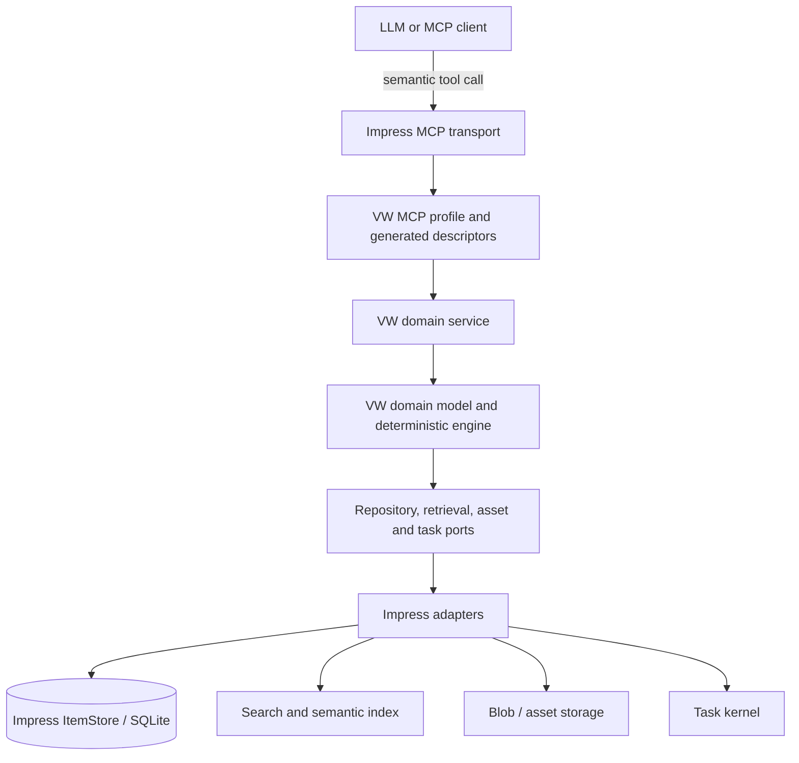
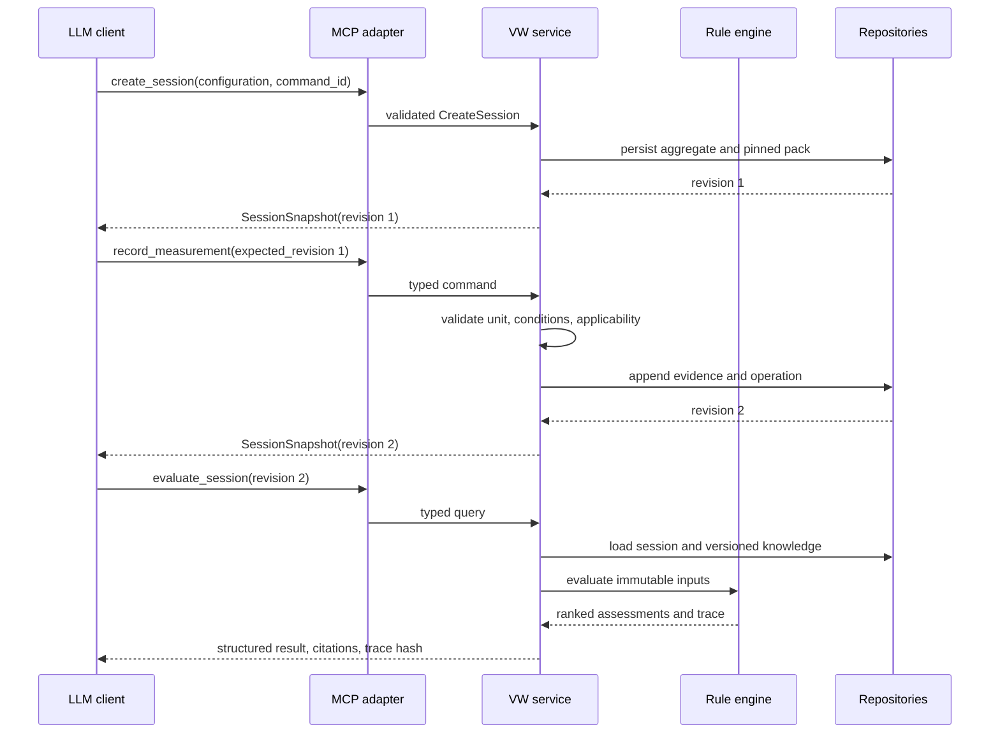
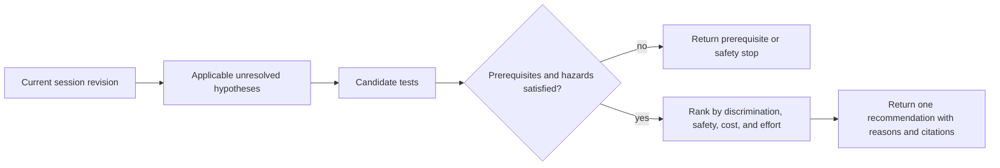

# MCP-First Expert-System Architecture

**Status:** proposed boundary and semantic API; no implementation in this study

## 1. Decision

The VW assistant should be exposed through Impress's generated Rust service
surface. The MCP server is an adapter over a typed domain service, not an
alternate application and not a database shell.



This preserves the required direction:

```text
Rust domain model -> domain services -> MCP projection -> LLM interaction
```

The inverse direction—LLM-generated queries sent directly to SQLite—is out of
scope and should remain impossible in the VW MCP profile.

## 2. What already exists

Impress already provides the difficult transport and discovery mechanics:

- `#[impress_service]` and `#[impress_method]` define a Rust service once;
- `impress-service-core` inventories methods and their JSON schemas;
- the same service handler supports MCP and CLI projections;
- `impress-mcp` implements stdio JSON-RPC, resource discovery, tool discovery,
  grouped and flat surfaces, and app reachability;
- store, collection, and task services demonstrate generated registration and
  inventory tests.

The implementation should extend that path. A hand-written VW JSON-RPC server
would duplicate validation, error mapping, discovery, and test infrastructure.

The current MCP package is a binary target that force-links known service
crates, including embeddings, Typst rendering, all app services, and the
working-tree AI service. That gives the suite one complete server, but it is the
wrong product assembly boundary for a focused expert application. Extract the
protocol host into a reusable library (or equivalent internal host crate), then
let a small VW binary deliberately link the VW and required substrate service
crates. Registration can remain compile-time. This is a packaging seam, not a
reason to invent a dynamic plugin system.

## 3. Service boundary

### 3.1 Domain service

The service accepts domain commands and queries. It owns orchestration,
authorization of state transitions, source applicability checks, and the
creation of inference traces. It does not expose storage records as its primary
contract.

An illustrative, non-compiling shape is:

```rust
#[impress_service(name = "vw_diagnostic")]
trait VwDiagnosticService {
    #[impress_method]
    async fn create_session(
        &self,
        request: CreateSession,
    ) -> Result<SessionSnapshot, DomainError>;

    #[impress_method]
    async fn record_observation(
        &self,
        command: RecordObservation,
    ) -> Result<SessionSnapshot, DomainError>;

    #[impress_method]
    async fn evaluate_session(
        &self,
        query: EvaluateSession,
    ) -> Result<DiagnosticAssessment, DomainError>;

    #[impress_method]
    async fn recommend_next_test(
        &self,
        query: RecommendNextTest,
    ) -> Result<NextTestRecommendation, DomainError>;
}
```

The exact macro syntax must follow the repository's service-codegen contract;
the example expresses ownership, not a new code-generation design.

### 3.2 Impress adapters

The domain service depends on ports whose Impress implementations provide:

| Port | Impress implementation |
|---|---|
| Session and knowledge repository | `ItemStore`, registered schemas, typed references |
| Exact and structured retrieval | `ItemQuery`, indexes, schema-specific projections |
| Semantic retrieval | generalized chunk and embedding index |
| Source content | asset/blob store plus source locators |
| Long-running work | canonical task service and executor |
| Change notification | store subscriptions or durable revision polling |
| Audit history | operations, author attribution, HLC, and provenance metadata |

MCP code must not know the storage schema needed to satisfy these ports.

## 4. Semantic tool surface

The public surface should be small enough for reliable tool choice and complete
enough that the client never needs raw store tools. Names below are proposed
semantic operations; final grouping should follow the projection rules in
ADR-0024.

### 4.1 Orientation and configuration

| Operation | Purpose | Mutates state? |
|---|---|---:|
| `get_capabilities` | Return supported vehicle scope, knowledge-pack version, and safety limitations | No |
| `identify_vehicle_configuration` | Resolve supplied identifiers and features into a configuration, reporting ambiguity | No |
| `search_knowledge` | Retrieve applicable components, facts, procedures, figures, and source passages | No |
| `get_source_excerpt` | Resolve a citation to bounded text and asset/page metadata | No |
| `list_applicable_procedures` | Return procedures valid for a configuration and current session state | No |

`identify_vehicle_configuration` must not guess silently. A partial match
returns candidates and the discriminating questions needed to select one.

### 4.2 Diagnostic session

| Operation | Purpose | Mutates state? |
|---|---|---:|
| `create_session` | Pin vehicle configuration and knowledge-pack version | Yes |
| `get_session` | Return a typed session snapshot and current revision | No |
| `record_observation` | Add or correct a controlled observation | Yes |
| `record_measurement` | Add a quantity, unit, method, conditions, and instrument | Yes |
| `evaluate_session` | Apply rules and persist or return a reproducible assessment trace | No by default |
| `recommend_next_test` | Select the safe, applicable test with the best declared discrimination | No |
| `explain_hypothesis` | Report supporting, contradicting, missing, and inapplicable evidence | No |
| `close_session` | Close with outcome, unresolved questions, and final revision | Yes |

`evaluate_session` should be a pure query over an explicit revision unless the
caller requests that its trace be attached to the session. Keeping evaluation
pure makes replay and testing straightforward.

### 4.3 Procedure and repair execution

| Operation | Purpose | Mutates state? |
|---|---|---:|
| `start_procedure` | Check prerequisites and create a procedure run | Yes |
| `record_procedure_step` | Record completion, result, skip reason, or safety stop | Yes |
| `pause_procedure` | Preserve resumable state | Yes |
| `plan_repair` | Build a cited repair plan from an assessed hypothesis | Yes |
| `record_repair_result` | Record work performed and verification outcome | Yes |

Procedures are state machines. A generic `set_status` tool would let clients
bypass prerequisites, ordered steps, and safety acknowledgements; it should not
be exposed.

## 5. Resources versus tools

Stable orientation material belongs in MCP resources:

- `impress://expert/vw/guide` — tool semantics and safety contract;
- `impress://expert/vw/capabilities` — supported configuration and feature set;
- `impress://expert/vw/knowledge-pack` — active pack identity, source set, and
  build status;
- `impress://expert/vw/schema` — public domain vocabulary and units.

Live or private data—sessions, observations, measurements, and procedure
runs—should be obtained through tools. This makes authorization and revision
checks explicit and avoids clients caching a mutable resource as if it were
reference documentation.

## 6. Contract design

### 6.1 Commands

Every mutating request carries:

```text
command_id         caller-generated UUID for idempotency
session_id         aggregate being changed
expected_revision  optimistic concurrency guard
actor              local user or delegated agent identity
payload            typed command body
```

On retry, the same `command_id` returns the original result. A mismatched
`expected_revision` returns the current revision and a structured conflict; it
does not silently overwrite newer evidence.

### 6.2 Query responses

Evidence-bearing responses carry, as applicable:

- `knowledge_pack_id` and version;
- `session_revision`;
- typed result data, not prose alone;
- `citation_ids` and bounded source locators;
- curation status (`proposed`, `verified`, or `published`);
- applicability result and reason;
- `trace_id`, `rule_set_version`, and deterministic `trace_hash`;
- warnings and explicit unknowns.

Human-readable summaries are useful but secondary. A caller must be able to
render or inspect the structured answer without asking the LLM to reconstruct
the evidence chain.

### 6.3 Measurements

MCP input accepts a value and unit but the service normalizes them into a
canonical quantity after dimensional validation. It retains the entered text,
test conditions, acquisition method, instrument, and uncertainty. A bare
`{"voltage": 12}` is not a valid diagnostic measurement.

### 6.4 Citations

A source response identifies the source asset, edition or revision, page label
and physical page index when available, bounded text span, figure/table region,
extraction run, and content hash. The MCP layer may render a compact citation,
but it must not collapse this structure into a URL string.

## 7. Interaction sequences

### 7.1 Evidence-based diagnosis



### 7.2 Safe next procedure



The LLM explains or asks for data; it does not choose a hidden alternate test
after the engine has returned an unsafe or inapplicable result.

## 8. Error model

Errors should be stable codes with typed detail and a concise user-facing
message:

| Code | Meaning | Expected caller behavior |
|---|---|---|
| `invalid_input` | Type, unit, range, or required field is invalid | Correct the request |
| `configuration_ambiguous` | More vehicle details are required | Ask discriminating questions |
| `configuration_mismatch` | Knowledge or procedure does not apply | Select applicable knowledge |
| `stale_revision` | Session changed since the caller read it | Reload and reconcile |
| `unsafe_precondition` | A hazard acknowledgement or prerequisite is absent | Stop and satisfy it |
| `knowledge_not_verified` | Only unreviewed extraction supports the result | Report limitation or request review |
| `citation_unresolvable` | Source content or locator is unavailable | Do not present the claim as sourced |
| `knowledge_pack_mismatch` | Session and requested pack differ | Use pinned pack or explicitly migrate |
| `task_pending` | Long-running extraction/index work is incomplete | Poll the returned task ID |
| `not_found` | Domain object does not exist or is not visible | Correct the identifier |

Transport errors and domain errors remain distinct. JSON-RPC success with a
free-form error string would make recovery unreliable.

## 9. Long-running operations

OCR, corpus import, embedding generation, and pack compilation should not run
inside a normal MCP request. A semantic command creates a canonical Impress
task and returns its ID. Status queries expose progress, warnings, products,
and a cancellation request where the underlying worker supports cancellation.

Interactive session commands should remain short transactions. MCP stdio is a
local transport and should not be treated as a durable job queue.

## 10. Surface profiles and access

The VW deployment should use the reusable MCP host and publish an explicit
`vw-diagnostic` MCP profile:

- include VW semantic services plus minimal task-status and orientation tools;
- hide raw item mutation, arbitrary query, migration, and administration tools;
- use the same descriptors for CLI parity and contract tests;
- mark administrative ingestion and curation operations as a separate profile;
- keep local stdio as the first transport.

The link set and the exposed profile are separate controls: the link set keeps
the product dependency graph intentional, while the profile determines the
capabilities visible to a client.

Hiding raw tools is not security by itself, but it creates a capability surface
that can later be authorized consistently in local HTTP and PWA adapters.

The MCP adapter must never accept secrets to store in item payloads. If remote
transport is introduced, authentication, origin checks, rate limits, request
size bounds, and log redaction belong at that transport boundary.

## 11. LLM responsibility

The LLM may:

- translate conversation into typed observations and proposed measurements;
- ask configuration and procedure questions;
- call semantic domain tools;
- summarize returned structured evidence with its citations;
- explain uncertainty and unknowns in accessible language.

The LLM may not:

- write directly to SQLite or fabricate item payloads;
- invent measurements, thresholds, applicability, or source citations;
- skip procedure prerequisites;
- convert ordinal scores into probabilities;
- diagnose from retrieved prose while ignoring the deterministic engine;
- silently move a session to a different knowledge-pack version.

## 12. Verification strategy

1. **Descriptor tests:** all intended methods register once, have meaningful
   descriptions, and emit bounded JSON schemas.
2. **Profile tests:** the VW profile contains every semantic tool and excludes
   raw store mutations.
3. **Contract tests:** representative requests round-trip through generated MCP
   JSON into domain commands and typed responses.
4. **Parity tests:** CLI and MCP invoke the same handler and return equivalent
   structured results.
5. **Idempotency tests:** repeated command IDs do not duplicate observations or
   procedure steps.
6. **Concurrency tests:** stale revisions fail with reconstructable conflicts.
7. **Golden diagnostic tests:** fixed knowledge and session inputs produce the
   same rule IDs, ranking, citation IDs, and trace hash.
8. **Safety tests:** unsafe and inapplicable procedures cannot be started by
   alternate wording or malformed client input.

Generated prose is deliberately excluded from golden tests. The domain result,
not a model's wording, is the stable contract.

## 13. Decisions deferred

- Remote MCP or HTTP transport is unnecessary for the first local validation.
- Streaming partial diagnosis is unnecessary; task progress and complete
  deterministic results are sufficient.
- Per-tool authorization can wait until a non-local deployment exists, but
  profiles should establish the capability boundary now.
- Dynamic service loading is not justified by the VW case.

## Related documents

- [ExpertSystemArchitecture.md](ExpertSystemArchitecture.md)
- [ImpressReuseAudit.md](ImpressReuseAudit.md)
- [VWKnowledgeArchitecture.md](VWKnowledgeArchitecture.md)
- [FutureRoadmap.md](FutureRoadmap.md)
