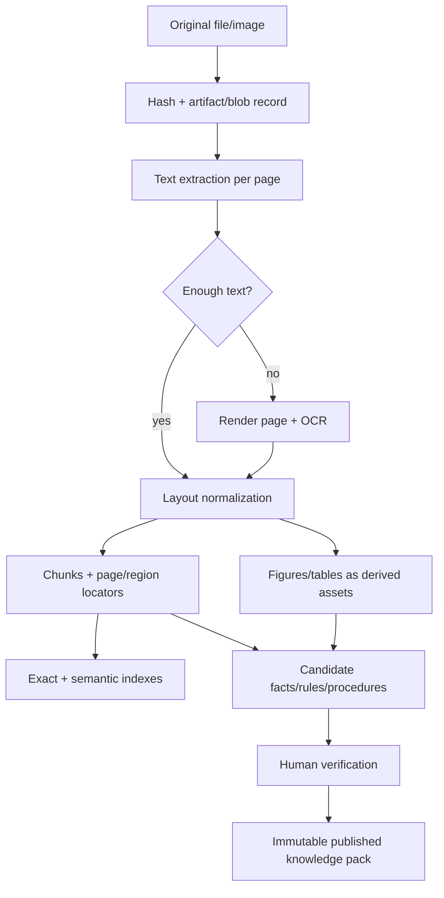

# VW Knowledge and Diagnostic Architecture

**Validation vehicle:** Volkswagen Type 2, model year 1978, California market,
L-Jetronic fuel injection  
**Status:** domain design only; mechanical facts and thresholds must come from
the curated source corpus

## 1. Domain boundary

The first domain library is a diagnostic assistant for one narrowly identified
configuration, but its model must not assume every Type 2 has the same engine,
emissions equipment, wiring, components, or procedures. Vehicle configuration
and knowledge applicability are therefore load-bearing types, not tags added
later.

The library owns:

- vehicle/configuration/component identity;
- observations and typed measurements;
- procedures and procedure runs;
- diagnostic sessions and their lifecycle;
- fault hypotheses, evidence assessments, and repair actions;
- applicability and safety rules;
- deterministic inference and explanation traces;
- mapping between curated source claims and domain rules.

It does not own SQLite, MCP JSON-RPC, OCR, PDF rendering, vector databases,
LLM providers, or UI state.

## 2. Model design principles

1. **Configuration before diagnosis.** No rule or procedure is considered until
   its applicability matches the vehicle.
2. **Unknown is explicit.** Missing configuration, unperformed tests, and
   ambiguous observations are not `false`.
3. **Measurements are quantities, not strings.** Value, unit, tolerance,
   acquisition conditions, and instrument belong together.
4. **Definitions are immutable by version.** Sessions pin procedure/rule/source
   versions so later edits do not rewrite history.
5. **Runs are distinct from definitions.** A procedure describes what should
   happen; a procedure run records what did happen.
6. **Evidence is evaluated, not merely linked.** A relation to a hypothesis must
   state polarity, strength, rule, and rationale.
7. **Scores are ordinal.** V1 rankings prioritize investigation; they are not
   failure probabilities.
8. **Citations are data.** Page/figure/table locators and source hashes survive
   rendering and are present in every knowledge-bearing response.

## 3. Proposed Rust domain structures

The following shapes are design contracts, not code to be implemented verbatim.
IDs are newtypes in the domain library and map to Impress item IDs at the
adapter boundary.

### Identity, vehicle, and configuration

```rust
struct VehicleId(Uuid);
struct ConfigurationId(Uuid);
struct ComponentId(Uuid);
struct SessionId(Uuid);
struct ProcedureId(String);       // stable domain key
struct RuleId(String);            // stable domain key
struct KnowledgePackId(String);

struct Vehicle {
    id: VehicleId,
    display_name: String,
    vin: Option<String>,
    configuration_id: ConfigurationId,
    odometer: Option<Quantity>,
    notes: Option<String>,
    created_at: DateTime<Utc>,
}

struct VehicleConfiguration {
    id: ConfigurationId,
    model_family: VehicleModel,
    model_year: u16,
    market: Market,
    emissions_spec: EmissionsSpecification,
    engine: EngineConfiguration,
    fuel_system: FuelSystemConfiguration,
    transmission: Option<TransmissionConfiguration>,
    installed_options: BTreeSet<OptionCode>,
    deviations: Vec<ConfigurationDeviation>,
    verification: VerificationState,
}

enum VehicleModel { Type2, Other(String) }
enum Market { California, FederalUs, Canada, Europe, Other(String) }
enum VerificationState { Unverified, PartiallyVerified, Verified }

struct ConfigurationDeviation {
    field: ConfigurationPath,
    expected: DomainValue,
    observed: DomainValue,
    citation: Option<SourceCitation>,
    note: String,
}
```

`VehicleConfiguration` describes the actual vehicle, not merely a catalog
variant. A replaced engine, modified harness, or deleted emissions component
must be recorded as a deviation because it changes applicability.

### Components and systems

```rust
struct Component {
    id: ComponentId,
    key: String,
    name: String,
    system: SystemId,
    parent: Option<ComponentId>,
    part_numbers: BTreeSet<String>,
    terminals: Vec<Terminal>,
    applicability: Applicability,
    description: Option<String>,
    citations: Vec<SourceCitation>,
}

struct Terminal {
    label: String,
    connector: Option<String>,
    circuit: Option<String>,
}

struct Applicability {
    all: Vec<ApplicabilityPredicate>,
    any: Vec<ApplicabilityPredicate>,
    none: Vec<ApplicabilityPredicate>,
}

enum ApplicabilityPredicate {
    ModelYear(RangeInclusive<u16>),
    Market(Market),
    EmissionsSpec(String),
    EngineCode(String),
    FuelSystem(String),
    HasOption(OptionCode),
    HasComponent(String),
    ConfigurationEquals(ConfigurationPath, DomainValue),
}
```

Applicability uses a typed predicate AST. Free-form strings may be retained as
curator notes, but they must not decide which procedures execute.

### Observations and measurements

```rust
struct ObservationId(Uuid);
struct MeasurementId(Uuid);

struct Observation {
    id: ObservationId,
    session_id: SessionId,
    kind: ObservationKind,
    value: ObservationValue,
    acquisition: Acquisition,
    confidence: Confidence,
    recorded_at: DateTime<Utc>,
    component: Option<ComponentId>,
    conditions: Vec<Condition>,
    notes: Option<String>,
    supersedes: Option<ObservationId>,
}

enum ObservationKind {
    Symptom,
    VisualInspection,
    Sound,
    Smell,
    Leak,
    State,
    ProcedureResult,
    Other(String),
}

enum ObservationValue {
    Present,
    Absent,
    Unknown,
    Category(String),
    Text(String),
    Boolean(bool),
}

struct Measurement {
    id: MeasurementId,
    session_id: SessionId,
    quantity: QuantityKind,
    value: Quantity,
    expected: Option<ExpectedRange>,
    acquisition: Acquisition,
    measured_at: DateTime<Utc>,
    component: Option<ComponentId>,
    terminals: Option<TerminalPair>,
    conditions: Vec<Condition>,
    source_step: Option<ProcedureStepRef>,
    notes: Option<String>,
}

struct Quantity {
    value: Decimal,
    unit: Unit,
    uncertainty: Option<Decimal>,
}

struct ExpectedRange {
    lower: Bound<Quantity>,
    upper: Bound<Quantity>,
    conditions: Vec<Condition>,
    citation: SourceCitation,
}

enum Acquisition {
    UserReported,
    UserObserved,
    Instrument { kind: String, identifier: Option<String> },
    Imported { source: String },
    SystemDerived { algorithm: String, version: String },
}

enum Confidence { Uncertain, Plausible, Confirmed }
```

Use an established quantity/unit crate if it satisfies serialization and
domain needs; do not invent conversion arithmetic casually. Preserve the
entered value/unit and store a normalized comparison value only as a derived
projection.

### Procedures and procedure runs

```rust
struct Procedure {
    id: ProcedureId,
    version: Version,
    title: String,
    purpose: String,
    applicability: Applicability,
    hazards: Vec<Hazard>,
    prerequisites: Vec<Prerequisite>,
    required_tools: Vec<ToolRequirement>,
    steps: Vec<ProcedureStep>,
    citations: Vec<SourceCitation>,
    status: KnowledgeStatus,
}

struct ProcedureStep {
    key: String,
    instruction: String,
    illustration: Option<SourceCitation>,
    confirmation: ConfirmationRequirement,
    capture: Option<CaptureSpec>,
    branches: Vec<ProcedureBranch>,
    stop_conditions: Vec<StopCondition>,
    citations: Vec<SourceCitation>,
}

enum CaptureSpec {
    Observation { kind: ObservationKind, allowed: Vec<ObservationValue> },
    Measurement { quantity: QuantityKind, allowed_units: Vec<Unit> },
    Choice { options: Vec<String> },
    Text,
}

struct ProcedureRun {
    id: Uuid,
    session_id: SessionId,
    procedure: VersionedRef<ProcedureId>,
    state: ProcedureRunState,
    current_step: Option<String>,
    completed_steps: Vec<StepResult>,
    started_at: DateTime<Utc>,
    completed_at: Option<DateTime<Utc>>,
    performed_by: ActorRef,
}

enum ProcedureRunState {
    Planned,
    Active,
    WaitingForInput,
    StoppedForSafety,
    Completed,
    Abandoned,
}
```

The runner accepts explicit commands such as `start`, `record_step_result`,
`confirm_hazard`, `advance`, `stop`, and `abandon`. The service calculates the
legal next step; the LLM never chooses a branch by editing `current_step`.

### Sessions, hypotheses, evidence, and repairs

```rust
struct DiagnosticSession {
    id: SessionId,
    vehicle_id: VehicleId,
    state: DiagnosticSessionState,
    concern: String,
    opened_at: DateTime<Utc>,
    closed_at: Option<DateTime<Utc>>,
    knowledge_pack: KnowledgePackRef,
    inference_engine: EngineVersion,
    revision: u64,
    active_procedure_run: Option<Uuid>,
    dispositions: Vec<HypothesisDisposition>,
    outcome: Option<DiagnosticOutcome>,
}

enum DiagnosticSessionState {
    Intake,
    Diagnosing,
    RepairPlanned,
    RepairInProgress,
    Verification,
    Closed,
    Abandoned,
}

struct FaultHypothesis {
    id: String,
    title: String,
    system: SystemId,
    component: Option<ComponentId>,
    applicability: Applicability,
    description: String,
    severity: Severity,
    citations: Vec<SourceCitation>,
}

struct EvidenceAssessment {
    evidence: EvidenceRef,
    hypothesis_id: String,
    rule: VersionedRef<RuleId>,
    polarity: EvidencePolarity,
    strength: EvidenceStrength,
    rationale: String,
    citations: Vec<SourceCitation>,
}

enum EvidencePolarity { Supports, Contradicts, Excludes, Neutral }
enum EvidenceStrength { Weak, Moderate, Strong }

struct HypothesisAssessment {
    hypothesis_id: String,
    excluded: bool,
    priority_score: i32,
    supporting: Vec<EvidenceAssessment>,
    contradicting: Vec<EvidenceAssessment>,
    missing_discriminators: Vec<EvidenceRequirement>,
}

struct RepairAction {
    id: String,
    title: String,
    applicability: Applicability,
    target: Vec<ComponentId>,
    prerequisites: Vec<Prerequisite>,
    hazards: Vec<Hazard>,
    procedure: Option<VersionedRef<ProcedureId>>,
    verification: Vec<VersionedRef<ProcedureId>>,
    citations: Vec<SourceCitation>,
}
```

### Source citations and extraction provenance

`SourceCitation` should be the shared Impress type proposed in the reuse audit.
The VW domain consumes it but does not define PDF coordinate conventions.

```rust
struct SourceCitation {
    id: CitationId,
    source_item_id: Uuid,
    source_content_hash: String,
    extraction_run_id: Option<Uuid>,
    locator: SourceLocator,
    quote: Option<String>,
    quote_hash: Option<String>,
    title: Option<String>,
}

struct SourceLocator {
    page_index: Option<u32>,       // machine, zero-based
    page_label: Option<String>,    // human-visible, e.g. roman or supplement
    region: Option<NormalizedRect>,
    char_range: Option<Range<u64>>,
    section_path: Vec<String>,
    figure_label: Option<String>,
    table_label: Option<String>,
}
```

A citation is unresolved if the source hash no longer matches and the quote or
region cannot be found in the new extraction. It remains in history but cannot
silently support newly evaluated rules.

## 4. Knowledge pack and curation model

### Knowledge statuses

```text
extracted → proposed → verified → published
                     ↘ rejected
published → superseded
```

- **extracted:** raw OCR/text/table/figure output;
- **proposed:** typed fact, rule, or procedure proposed by a human or agent;
- **verified:** curator checked semantics, applicability, units, and citations;
- **published:** included in an immutable knowledge-pack version;
- **rejected:** retained with rationale so repeated extraction does not
  resurrect it;
- **superseded:** preserved for sessions pinned to an older pack.

Only `published` knowledge participates in normal diagnosis. A developer mode
may evaluate proposed content, but the trace must be visibly marked unverified.

### Pack manifest

```rust
struct KnowledgePackManifest {
    id: KnowledgePackId,
    version: Version,
    content_hash: String,
    domain_schema_version: Version,
    created_at: DateTime<Utc>,
    source_hashes: BTreeMap<Uuid, String>,
    fact_versions: BTreeMap<String, Version>,
    procedure_versions: BTreeMap<ProcedureId, Version>,
    rule_versions: BTreeMap<RuleId, Version>,
    validator_version: String,
    validation_report_hash: String,
}
```

The pack is immutable and portable. Publishing validates that every executable
rule and procedure has at least one resolvable citation, every referenced key
exists, branches are reachable, units are compatible, and applicability is not
empty or contradictory.

## 5. Persistence mapping onto Impress

Use versioned schema refs and typed adapter functions. Proposed initial refs:

| Domain type | Schema ref | Important edges |
|---|---|---|
| Vehicle | `vw/vehicle@1.0.0` | `RelatesTo → configuration` |
| Configuration | `vw/configuration@1.0.0` | `Contains → installed components` where useful |
| Component | `vw/component@1.0.0` | parent or `IsPartOf`; `RelatesTo` systems |
| Observation | `vw/observation@1.0.0` | parent session; `OperatesOn → component` |
| Measurement | `vw/measurement@1.0.0` | parent session; `DerivedFrom → procedure run/step` |
| Procedure | `vw/procedure@1.0.0` | `Cites/References → citations/sources` |
| Procedure run | `vw/procedure-run@1.0.0` | parent session; `DerivedFrom → procedure version` |
| Session | `vw/diagnostic-session@1.0.0` | `OperatesOn → vehicle`; contains case records |
| Fault hypothesis | `vw/fault-hypothesis@1.0.0` | `RelatesTo → component/system` |
| Inference trace | `vw/inference-trace@1.0.0` | parent session; `DerivedFrom → evidence/rules` |
| Repair action | `vw/repair-action@1.0.0` | `OperatesOn → component`; references procedure |
| Citation | shared proposed `source-citation@1.0.0` | `References → source`; `DerivedFrom → extraction` |
| Extraction run/chunk | shared proposed schemas | `DerivedFrom → asset`; chunks parent source/extraction |

The table is a design starting point. Before implementation, reconcile exact
schema spellings with `schema-refs.json` and the repository's versioning rules.
Do not store both a payload UUID and an edge for the same relation unless one is
an intentional query projection with parity tests.

### What stays relational or indexed

Use normal item payloads initially. Add materialized/index tables only after
profiling. Likely hot projections are:

- session state/revision and vehicle ID;
- applicability facets such as year/market/engine/fuel system;
- procedure/rule key plus published pack version;
- normalized measurement quantity/unit/value;
- chunk FTS and embedding vectors.

These are projections, not a second authority.

## 6. Source ingestion and knowledge construction



### Required ingest behavior

- retain original bytes and metadata;
- hash before extraction and deduplicate by content, not filename;
- record extractor/OCR model versions and warnings;
- preserve page indices and visible page labels separately;
- retain image regions for figures/tables even when OCR text is poor;
- never collapse conflicting source claims during extraction;
- allow one knowledge assertion to cite multiple sources and one source span
  to support multiple assertions;
- make re-ingestion idempotent on `(content_hash, extractor_version,
  extraction_profile)`;
- mark derived indexes stale when any part of that key changes.

LLM assistance is suitable for proposing structured candidates, terminology
aliases, and cross-references. It is not suitable for verification or for
inventing missing table values.

## 7. Retrieval design

### Exact retrieval

Use exact/canonical lookup for:

- component and terminal keys;
- procedure/rule identifiers;
- part numbers and document identifiers;
- known phrases, table/figure labels, and page labels;
- session, vehicle, and configuration IDs.

### Structured retrieval

Filter by the actual configuration and knowledge-pack version before ranking:

- model year and market;
- emissions/fuel/engine configuration;
- installed component or option;
- system/component relation;
- procedure prerequisites and safety class;
- knowledge status and pack membership.

### Semantic retrieval

Semantic search operates over domain-neutral chunks with source locators. It is
best for “where does the manual discuss this symptom?” and for presenting
supporting passages. It is not authoritative for applicability or numeric
thresholds; those come from verified typed knowledge.

### Result contract

```rust
struct KnowledgeHit {
    item: KnowledgeItemRef,
    title: String,
    excerpt: String,
    citations: Vec<SourceCitation>,
    match_reasons: Vec<MatchReason>,
    applicability: ApplicabilityMatch,
    verification: KnowledgeStatus,
}
```

Every result reports why it matched and whether it applies. Page, figure, and
table rendering is resolved from citations after retrieval.

## 8. Deterministic rule system

### Rule representation

```rust
struct DiagnosticRule {
    id: RuleId,
    version: Version,
    title: String,
    applicability: Applicability,
    conditions: ConditionExpr,
    effects: Vec<RuleEffect>,
    citations: Vec<SourceCitation>,
    status: KnowledgeStatus,
}

enum ConditionExpr {
    All(Vec<ConditionExpr>),
    Any(Vec<ConditionExpr>),
    Not(Box<ConditionExpr>),
    ObservationMatches(ObservationSelector, ValuePredicate),
    MeasurementMatches(MeasurementSelector, QuantityPredicate),
    ConfigurationMatches(ApplicabilityPredicate),
    ProcedureCompleted(ProcedureId),
    EvidenceMissing(EvidenceRequirement),
}

enum RuleEffect {
    Assess {
        hypothesis_id: String,
        polarity: EvidencePolarity,
        strength: EvidenceStrength,
        rationale: String,
    },
    SuggestProcedure {
        procedure: ProcedureId,
        discrimination: EvidenceStrength,
        rationale: String,
    },
    RaiseSafetyGate(Hazard),
}
```

### Evaluation algorithm

1. Load the session snapshot and pinned pack.
2. Validate configuration completeness and report unknown load-bearing fields.
3. Select applicable hypotheses, rules, and procedures.
4. Evaluate each rule in stable `(rule_id, version)` order using three-valued
   condition results: `true`, `false`, `unknown`.
5. Emit effects only for `true`; record missing inputs for `unknown`.
6. Apply fixed weights, for example weak=1, moderate=2, strong=4. Exclusion is
   a separate boolean, not a very large negative number.
7. Rank non-excluded hypotheses by priority score, strongest direct evidence,
   fewer unresolved contradictions, then stable ID.
8. Rank next procedures by safety, prerequisites, expected discrimination,
   effort/cost class, and whether a result already exists.
9. Hash and persist the full input snapshot and output trace.

The exact weights must be named constants in the engine version and covered by
golden tests. The UI and MCP descriptions call the result a **priority**, not a
confidence percentage.

## 9. Session command model

Prefer commands over record CRUD:

- `OpenSession`
- `IdentifyConfiguration`
- `RecordObservation`
- `RecordMeasurement`
- `CorrectObservation` (supersedes; does not erase history)
- `StartProcedure`
- `RecordProcedureStep`
- `StopProcedureForSafety`
- `CompleteProcedure`
- `EvaluateSession`
- `AcceptRepairPlan`
- `RecordRepairAction`
- `VerifyRepair`
- `CloseSession`

Each command has a unique ID, expected session revision, actor, timestamp, and
validated payload. Domain events/operations are produced atomically. Illegal
state transitions return structured errors.

## 10. Testing and validation strategy

### Pure domain tests

- applicability truth tables for every market/year/configuration facet;
- unit conversion and tolerance boundary cases;
- three-valued condition evaluation;
- stable rule ordering and tie-breaking;
- conflict and exclusion behavior;
- procedure branch reachability and safety stops;
- session state-machine transitions;
- serialization golden files for all public DTOs.

### Knowledge-pack validation

- every published fact/rule/procedure has resolvable citations;
- every locator resolves against the pinned asset/extraction hash;
- all component, procedure, rule, and hypothesis references exist;
- measurement comparisons use compatible units;
- no branch target is missing; no required step is unreachable;
- no applicability expression is contradictory;
- no proposed/rejected knowledge enters the executable pack.

### End-to-end fixtures

Create fictional or source-derived diagnostic cases with known traces. Fixtures
must test incomplete and contradictory evidence, not only happy-path trees.
Snapshot the semantic MCP response including rule IDs, citation IDs, and trace
hash; avoid snapshotting prose generated by an LLM.

## 11. Safety and wording policy

- Procedures show hazards before actionable steps and require explicit
  confirmation where defined.
- The system distinguishes “not observed,” “observed absent,” and “unknown.”
- A diagnosis is presented as a ranked, evidence-backed hypothesis assessment.
- Repair actions require supporting evidence and a post-repair verification
  procedure.
- If configuration or source support is inadequate, the correct result is to
  stop and request clarification or a safer test.
- No VW-specific claim is embedded in code or documentation without a source
  citation in the knowledge pack.

## Related documents

- [ExpertSystemArchitecture.md](ExpertSystemArchitecture.md)
- [ImpressReuseAudit.md](ImpressReuseAudit.md)
- [MCPArchitecture.md](MCPArchitecture.md)
- [FutureRoadmap.md](FutureRoadmap.md)
