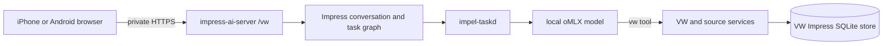

# Connected VW Web Guide

The connected VW interface reuses the authenticated Impress AI web server,
durable conversation graph, oMLX provider, task worker, pairing flow, and
generated service inventory. `/vw` is a presentation and tool-policy preset,
not a second application or database API.

## Current scope

- The phone must be online and able to reach the Mac.
- The Mac must be awake with oMLX, `impress-ai-server`, and `impel-taskd`
  running.
- Conversations, tasks, tool calls, citations, and diagnostic sessions are
  durable in the server-side Impress store.
- The model can search source pages, load a complete selected page, resolve its
  citation, and invoke typed VW diagnostic operations.
- The model cannot invoke source ingestion or curation writes through the VW
  policy.
- The current bootstrap knowledge pack has no published mechanical rules.
  Manual lookup works; deterministic diagnosis becomes useful as reviewed
  rules and procedures are published.

This release intentionally does not install a service worker or synchronize an
offline browser database.

## Start the connected stack

Use the same absolute store path for both processes. From the repository root:

    export IMPRESS_STORE_PATH="$PWD/.local/vw-knowledge.sqlite"
    export IMPRESS_OMLX_URL="http://127.0.0.1:8000"
    export IMPRESS_AI_ACCESS_TOKEN="replace-with-a-random-value-of-at-least-24-characters"

Start the HTTP adapter:

    cargo run -p impress-ai-http --bin impress-ai-server

In another shell with `IMPRESS_STORE_PATH` and `IMPRESS_OMLX_URL` set, start
the durable model worker:

    cargo run -p impel-taskd -- --enable --start-delay 0

Keep the HTTP server bound to its default loopback address and publish it over
a private HTTPS connection such as Tailscale Serve. Do not publish it through
a public funnel. The access token remains required even on the private network.

## Pair a phone

With the HTTP server running, mint a single-use ticket from the Mac:

    curl -sS -X POST \
      -H "Authorization: Bearer $IMPRESS_AI_ACCESS_TOKEN" \
      http://127.0.0.1:23125/api/pairing-tickets

Copy the returned ticket into the private HTTPS URL:

    https://YOUR-PRIVATE-MAC-ADDRESS/vw#pair=TICKET

Open that URL once on each phone. The ticket expires after 15 minutes and is
deleted on first use, so mint a separate ticket for the second phone. The
browser stores the resulting bearer in session storage and removes the ticket
from the visible address.

## VW profile behavior

The `/vw` profile starts new conversations with only the `vw` policy enabled.
Its system instruction requires source lookup before factual repair claims,
page and citation identifiers, explicit applicability, and no invented
measurements or specifications. Web search can still be enabled manually, but
it is off by default so admitted sources remain clearly distinguishable from
general internet context.

The local model sees one compact `vw` tool. Its actions are generated directly
from the Rust service contracts:

- `source.search-content-chunks`
- `source.get-content-chunk`
- `source.get-citation`
- `diagnostic.*`

Tool results and failures are stored with the conversation's normal Impress AI
provenance.
